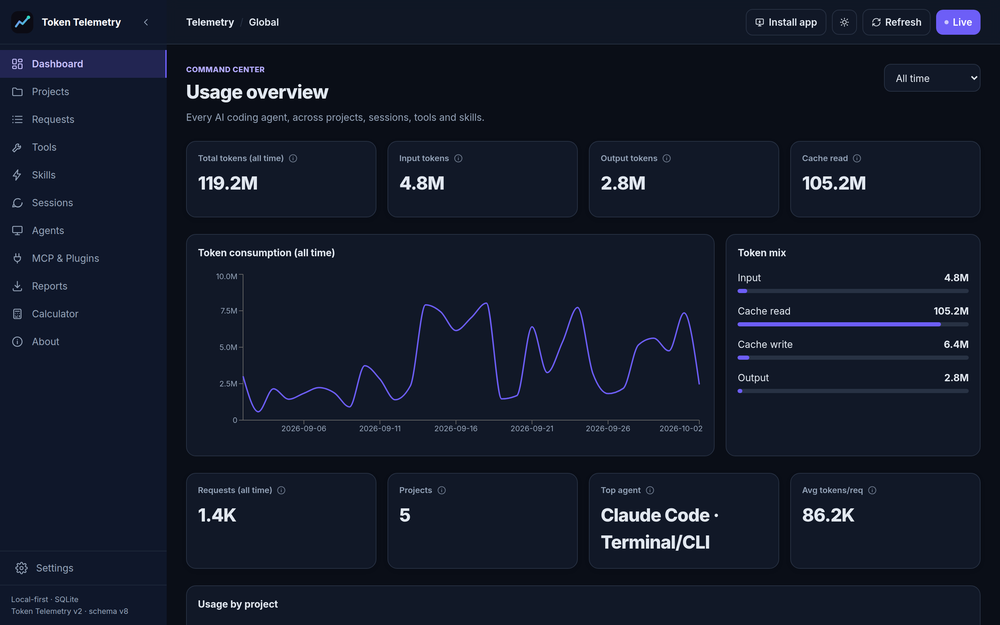
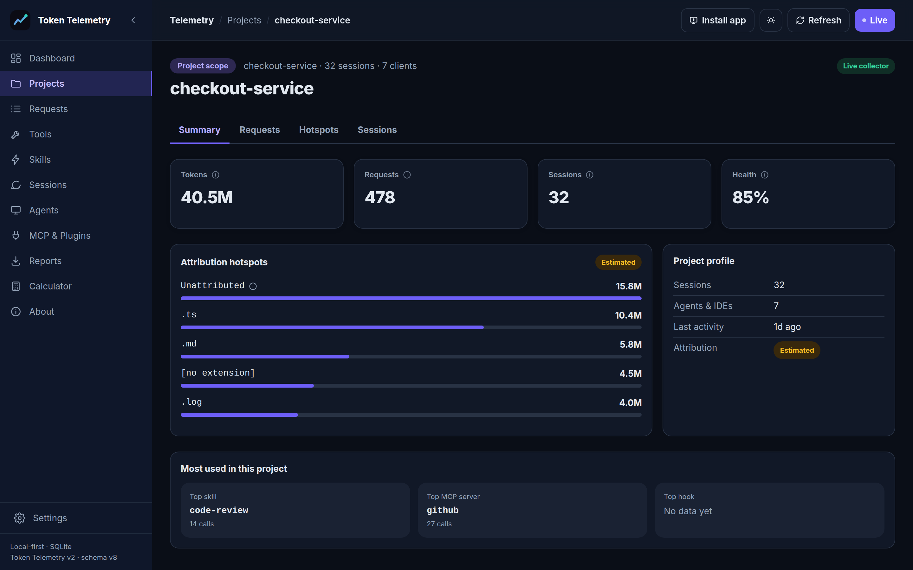
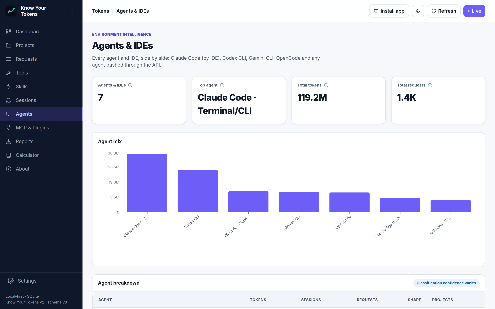
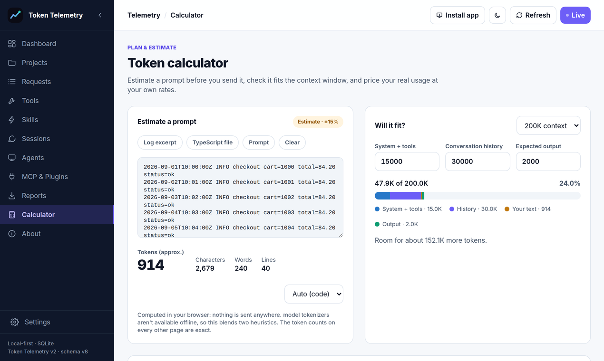

<div align="center">

# Know Your Tokens

### Every AI coding agent. Every token. One local dashboard.

Local-first, open-source observability for AI coding agents (Claude Code, Codex CLI, Gemini CLI,
OpenCode, and any other agent through one API call). See exact token usage per request, project,
session, agent, tool, skill and MCP server, debug the prompt behind any spike, and keep it all on
your own machine. Includes a REST API, Python and TypeScript SDKs, OpenTelemetry export and webhooks.

<p>
  <a href="https://www.npmjs.com/package/knowyourtokens"></a>
  <a href="https://github.com/sarveshtalele/knowyourtokens/actions/workflows/ci.yml"></a>
  <a href="LICENSE"></a>
  
  <a href="https://sarveshtalele.github.io/knowyourtokens/"></a>
</p>

**[Website](https://sarveshtalele.github.io/knowyourtokens/)** ·
**[Install](#install)** ·
**[API](docs/API.md)** ·
**[Integrations](docs/INTEGRATIONS.md)** ·
**[Architecture](docs/ARCHITECTURE.md)** ·
**[Contributing](CONTRIBUTING.md)**

</div>

```bash
npx knowyourtokens
```

One command sets up a Python environment, starts the backend, the collector daemon and the dashboard
at **http://127.0.0.1:5173**, and picks up every supported agent it finds on your machine. It runs on
Windows, macOS and Linux.

## Supported agents

| Agent | How it's read | Live? |
|---|---|---|
| **Claude Code** (CLI, VS Code, JetBrains, Agent SDK, remote) | Session transcripts in `~/.claude/projects` + hooks | Live (hooks) |
| **Codex CLI** | Rollouts in `~/.codex/sessions` (per-response usage records) | Seconds |
| **Gemini CLI** | Chats in `~/.gemini/tmp/*/chats` | Seconds |
| **OpenCode** | Its SQLite database (`~/.local/share/opencode/opencode.db`), read-only | Seconds |
| **Anything else**: Antigravity, Cursor, Copilot CLI, your own agent, a CI job | `POST /api/v1/ingest` or the SDKs' `ingest()` | When you push |

Antigravity encrypts its local conversations and doesn't expose token usage on disk or over
OpenTelemetry today, so it can only be tracked by pushing usage (for example from headless runs).
Limit what's read with `KNOWYOURTOKENS_SOURCES=claude-code,codex`. Details:
[INTEGRATIONS](docs/INTEGRATIONS.md#track-any-agent).

<table>
<tr>
<td width="50%"><p align="center"><sub>Global dashboard</sub></p></td>
<td width="50%"><p align="center"><sub>Project detail</sub></p></td>
</tr>
<tr>
<td width="50%"><p align="center"><sub>Every agent side by side</sub></p></td>
<td width="50%"><p align="center"><sub>Token calculator</sub></p></td>
</tr>
</table>

## Why

Coding agents don't show you, across every project and every agent, how many tokens you're spending,
what fills your context, or which tools, skills and MCP servers drive it. Know Your Tokens does, side
by side for every agent you use, without sending your prompts anywhere.

## Features

- **Exact token accounting:** input, output, cache-read and cache-write tokens per API request, read
  from the usage each agent records itself. Each request is counted once, even when an agent repeats
  usage across lines (Claude Code) or reports running totals (Codex).
- **Every agent side by side:** compare Claude Code, Codex, Gemini CLI, OpenCode and any pushed agent
  on the same charts.
- **Every dimension:** projects, sessions, agents, models, IDEs, tools, skills, plugins, MCP servers,
  hook events, all time by default, with local-time-zone date filters.
- **Context hotspots (estimated, always labelled):** each request's exact total is spread across the
  files and tools around it.
- **Full prompt inspection:** the complete context and response behind any request, with likely secrets
  redacted. Full-text storage can be turned off.
- **Token calculator:** estimate a prompt before you send it, check it fits the context window, and
  price your real usage at your own rates (no built-in prices).
- **Exports:** streamed CSV, JSON or NDJSON with no row cap, safe against spreadsheet formula injection.
- **Built to integrate:** typed REST API with a published [OpenAPI document](docs/openapi.json),
  [Python](sdk/python) and [TypeScript](sdk/js) SDKs, [OpenTelemetry metrics and signed
  webhooks](docs/INTEGRATIONS.md).
- **Local and hardened:** binds to 127.0.0.1, rejects DNS rebinding and cross-site requests, stores the
  database `0600`, and supports optional retention. It sends no telemetry of its own.
- **No cost columns, by design:** billing depends on your plan. Export the tokens and apply your own
  rates.

## Install

Requires **Node.js 18+** and **Python 3.10+** (or [`uv`](https://docs.astral.sh/uv/), which is used
automatically when present).

```bash
npx knowyourtokens                 # install + start (re-resolves the latest version each time)
# or, for daily use:
npm install -g knowyourtokens
knowyourtokens                     # install (first run) + start
kyt doctor                         # kyt is a short alias for every command
```

Upgrading from Token Telemetry (the old name)? Run `npx knowyourtokens@latest install`. Your data,
hooks, launchers and `TOKENTELEMETRY_*` settings carry over as they are.

Per-OS notes, ports and troubleshooting: **[docs/INSTALLATION.md](docs/INSTALLATION.md)**.

## Everyday commands

```bash
knowyourtokens start               # backend + daemon + dashboard
knowyourtokens stop
knowyourtokens status              # processes + health checks
knowyourtokens doctor              # diagnose the install, with a fix for anything wrong
knowyourtokens autostart enable    # start at login (Task Scheduler / launchd / systemd)
knowyourtokens shortcut            # app icon for your Dock / taskbar / launcher (--dock on macOS)
```

**Use it like an app.** Click **Install app** in the dashboard's top bar (Chrome, Edge, Brave, Arc;
Safari: File → Add to Dock) to get its own window and icon. Or run `knowyourtokens shortcut`, which
creates a native launcher: a Start Menu/Desktop shortcut on Windows, `~/Applications/Know Your Tokens.app`
on macOS, and an app-launcher entry on Linux. Then pin it like any other app.

**Update:** `npm install -g knowyourtokens@latest && knowyourtokens install` (`npx` is always latest).
Upgrading from 1.x migrates the database automatically and backs it up first. See the
[changelog](CHANGELOG.md).

**Uninstall:**

```bash
knowyourtokens uninstall                          # remove the hooks, keep everything else
knowyourtokens uninstall --purge                  # + stop services, disable autostart, delete app files
knowyourtokens uninstall --purge --delete-data    # + delete the telemetry database
npm uninstall -g knowyourtokens
```

## Use the data elsewhere

```bash
curl "http://127.0.0.1:8000/api/v1/usage/summary?start=2025-06-01&end=2025-06-30"
```

```python
from knowyourtokens_client import KnowYourTokens          # pip install ./sdk/python
for p in KnowYourTokens().projects():
    print(p["project"], p["total_tokens"])
```

```bash
# Track any agent: push one record per model request (request_id makes retries safe)
curl -X POST http://127.0.0.1:8000/api/v1/ingest -H 'Content-Type: application/json' -d '{
  "agent": "Antigravity",
  "records": [{"request_id": "r-1", "cwd": "/work/app", "model": "gemini-3-pro",
               "input_tokens": 1200, "output_tokens": 300, "cache_read_tokens": 5000}]}'
```

```bash
export KNOWYOURTOKENS_OTLP_ENDPOINT=http://localhost:4318    # Grafana, Datadog, Honeycomb, ...
export KNOWYOURTOKENS_WEBHOOK_URL=https://example.com/hook   # HMAC-signed batches
```

Details: [API reference](docs/API.md) · [Integrations](docs/INTEGRATIONS.md).

## How it works

<p align="center"></p>

Hooks capture Claude Code events the instant they happen. The daemon reads only what's new in each
agent's session logs for exact usage and full text, and catches up after downtime. Full diagrams, the schema,
and design decisions are in [docs/ARCHITECTURE.md](docs/ARCHITECTURE.md).

## Documentation

| Document | Covers |
|---|---|
| [INSTALLATION](docs/INSTALLATION.md) | Per-OS install, settings, upgrading, troubleshooting |
| [USER_GUIDE](docs/USER_GUIDE.md) | Every page and metric, exact vs. estimated, exports |
| [API](docs/API.md) | REST conventions and endpoints ([OpenAPI](docs/openapi.json)) |
| [INTEGRATIONS](docs/INTEGRATIONS.md) | SDKs, OpenTelemetry, webhooks, writing an exporter |
| [ARCHITECTURE](docs/ARCHITECTURE.md) | Components, agent sources, data flow, schema v8, migrations |
| [SECURITY_REVIEW](docs/SECURITY_REVIEW.md) | Threat model and findings |
| [DESIGN](DESIGN.md) | Dashboard design tokens |
| [Launch kit](docs/launch/PRODUCT_HUNT.md) | [YouTube launch + guide](docs/launch/video/youtube-launch-and-guide-1920x1080.mp4) (2:33, narrated), [Instagram reel](docs/launch/video/launch-reel-1080x1920.mp4), social images, [integration map](docs/launch/integration-map-1600x860.png) |
| [ROADMAP](ROADMAP.md) · [CHANGELOG](CHANGELOG.md) | Where it's going, what changed |

## Contributing

Contributions are welcome. See [CONTRIBUTING.md](CONTRIBUTING.md) (`make setup && make check`), the
[Code of Conduct](CODE_OF_CONDUCT.md), and [SUPPORT.md](SUPPORT.md) for questions. Report
vulnerabilities privately: [SECURITY.md](SECURITY.md).

## License

[MIT](LICENSE) © Sarvesh Talele and contributors. Know Your Tokens is an independent project and is not
affiliated with or endorsed by Anthropic, OpenAI, Google, or any agent vendor.
