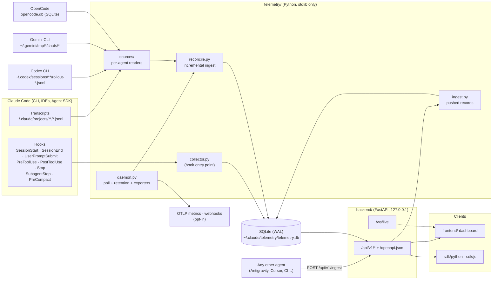
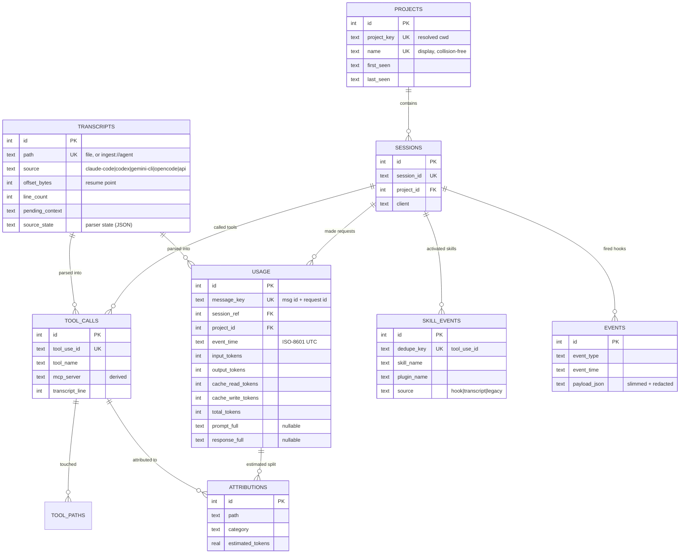

# Architecture

How Know Your Tokens is put together: the components, how data gets from an AI coding agent's session
(Claude Code, Codex CLI, Gemini CLI, OpenCode, or anything that pushes to the ingest API) into the
database, the schema, and why the main design decisions were made. For a tour of the dashboard,
see the [User Guide](USER_GUIDE.md). For the HTTP contract, see the [API reference](API.md).

## System overview

Everything runs on your machine. Nothing is sent anywhere unless you configure an exporter.



There are three capture paths into the same database:

1. **Hooks (Claude Code only).** Claude Code runs `hooks/claude-telemetry-hook.py` →
   `telemetry.collector` on every wired event. Each run writes one `events` row, plus a `skill_events`
   row for Skill invocations and a provisional `tool_calls` row on `PreToolUse`. A hook never fails the
   session: errors go to `hook-errors.log` next to the database and the process exits 0. Bulky fields
   such as `tool_response` are dropped before storage, and likely secrets are redacted.
2. **Reconcile (every built-in source).** `telemetry.daemon` calls `telemetry.reconcile` every
   `CLAUDE_TELEMETRY_INTERVAL` seconds. For each enabled [source](#sources) it reads only what is new
   in each session file since the last poll, using stored per-file state. Session files are the only
   source of **exact** per-request token usage and full prompt/response text, so reconcile fills
   `usage`, completes the `tool_calls` rows that hooks created (or creates them, for agents without
   hooks), and recomputes attributions for the lines that changed.
3. **Ingest API (any agent).** `POST /api/v1/ingest` hands pushed records to `telemetry.ingest`, which
   turns them into the same normalized events and runs them through the same pipeline under a virtual
   transcript (`ingest://<agent>`, `transcripts.source = 'api'`). See [API.md](API.md#ingest).

If the daemon was stopped, the next poll catches up from the stored state, so nothing is lost or
duplicated.

## Sources

[`telemetry/sources/`](../telemetry/sources) holds one reader per agent. Each is a subclass of
`Source` ([`__init__.py`](../telemetry/sources/__init__.py)) with a stable `name` (stored in
`transcripts.source`), a `label` (the default client name), `files()` to list session files on disk,
and `translate()` to turn native records into **normalized events**. Normalized events are shaped
like Claude Code transcript lines (`type`, `sessionId`, `cwd`, `timestamp`, `message.usage`,
`tool_use` blocks, plus `_client` naming the agent), so de-duplication, tool calls, skills, MCP
grouping, attribution and every dashboard page work the same for all agents.

```
 ~/.claude/projects/**/*.jsonl      ─┐
 ~/.codex/sessions/**/rollout-*     ─┤   Source (telemetry/sources/*.py)
 ~/.gemini/tmp/*/chats/*            ─┼─▶   kind_for(path):
 opencode.db (opened read-only)     ─┘       lines        new bytes from the stored offset
                                             document     whole file, re-read when it changes
                                             incremental  read_new(path, state) from a cursor
                                           translate(path, records, state)
                                                   │
                                                   ▼
 POST /api/v1/ingest ─▶ ingest.to_events() ─▶ normalized events ─▶ reconcile.ingest_lines()
                                                                     usage · tool_calls ·
                                                                     skill_events · attributions

 per-file resume state (table transcripts): offset_bytes, line_count, pending_context,
 source_state (JSON parser state), source (which agent)
```

There are three kinds of session file, and `kind_for(path)` can choose per file:

| Kind | Used for | How it's read |
|---|---|---|
| `lines` | Append-only JSONL (Claude Code, Codex) | From the stored byte offset; only complete lines |
| `document` | Files rewritten in place, or whose lines amend earlier ones (Gemini CLI chats, compressed Codex rollouts, legacy OpenCode JSON) | Re-read whole when `(mtime, size)` changes; the file's old rows are replaced, and stable ids keep this idempotent |
| `incremental` | A database (OpenCode's SQLite) | `read_new(path, state)` returns rows after a cursor kept in `state` |

`translate()` gets the file's parser state (`transcripts.source_state`, JSON) and may update it, for
example Codex's current session/model or its last cumulative token total.

| Source (`name`) | Files | Usage mapping |
|---|---|---|
| Claude Code (`claude-code`) | `$CLAUDE_CONFIG_DIR/projects/**/*.jsonl` | Native format; see [Ingest details](#ingest-details) |
| Codex CLI (`codex`) | `$CODEX_HOME/sessions/**/rollout-*.jsonl`, `archived_sessions/`, and `.jsonl.zst` (Python 3.14+ or `zstandard`, otherwise skipped) | One request per `token_usage_record` (keyed by `response_id`). Older rollouts without those use `token_count` events' `last_token_usage`, skipping repeats; `total_token_usage` is never summed. Codex's input includes cached input, so cached tokens are moved to cache read |
| Gemini CLI (`gemini-cli`) | `~/.gemini/tmp/<project>/chats/*.jsonl` and legacy `*.json` (`GEMINI_CLI_HOME`) | Last line per message id wins; `$rewindTo` drops the rewound messages. Cached tokens move from input to cache read, `thoughts` are added to output and `tool` to input. Project path from `~/.gemini/projects.json` |
| OpenCode (`opencode`) | `$XDG_DATA_HOME/opencode/opencode.db` (`OPENCODE_DB`), opened read-only; legacy `storage/` JSON only when there is no database | One request per `step-finish` part (keyed by part id); reasoning tokens are added to output |

Sources whose files don't exist are skipped. `KNOWYOURTOKENS_SOURCES` (for example
`claude-code,codex`) limits which are read. One bad file is logged and skipped; it never stops the
other files or sources.

To add a source: subclass `Source`, implement `files()`, `translate()` (and `load()` or `read_new()`
for the other kinds), register it in `all_sources()`, and add tests to `tests/test_sources.py`.

## Ingest details

These rules apply to normalized events from every source; the details below use Claude Code's format.

**One API request = one `usage` row.** Claude Code writes an assistant message as several JSONL lines,
one per content block (thinking, text, tool_use…), and **each line repeats the same `usage` object**.
Rows are keyed by `message.id + requestId` (`usage.message_key`). Repeated lines merge their text and
take the per-field maximum token count. Before v7, each line became its own row, which over-counted
tokens by about 2.5× on real transcripts.

**Prompt context.** All user-role blocks since the previous reply (the user message and every
`tool_result`) are joined into `prompt_full`, each block capped at 8 KB and the whole at 40 KB. Context
that isn't answered yet is persisted in `transcripts.pending_context`, so incremental reads don't lose
it.

**Partial writes.** Only complete lines are consumed. A final line without a newline is read only if it
already parses as JSON. A transcript that shrank (rewritten) is re-ingested from the start.

**Projects.** A project is identified by the session's starting directory (`projects.project_key` =
resolved path), not by its folder name. Two repos both called `api` stay separate (the second is
displayed as `api (parent)`). A `cd` inside a session does not move that session to another project.

**Clients.** Events from other sources carry `_client`, which becomes the client as-is (`Codex CLI`,
`Gemini CLI`, `OpenCode`, or the `agent` name of pushed records). Claude Code events are classified
from the `entrypoint` field when present (`cli`, `claude-vscode`, `sdk-py`, …), otherwise by
best-effort sniffing for IDE names.

**MCP.** Tool names of the form `mcp__<server>__<tool>` are grouped by server. Codex MCP calls (which
carry a namespace) are renamed to that form.

**Attribution (estimated).** A request's exact token total is split evenly across tool calls within ±5
transcript lines of it, then each tool's share evenly across the file paths it touched (or
`[unattributed]`). It's useful for finding hotspots. It is not a measurement, and it is labelled as an
estimate everywhere.

## Database schema (v8)

Defined once in [`telemetry/db.py`](../telemetry/db.py) and used by the hook, the daemon, the ingest
API and the read API.



Conventions:

- **Timestamps** are ISO-8601 UTC with millisecond precision and a `Z` suffix
  (`2025-01-02T03:04:05.678Z`), normalized on write. Plain string comparison is chronological. The API
  shifts day buckets to the caller's time zone (`tz_offset`).
- **Uniqueness carries the de-duplication rules.** `usage.message_key`, `tool_calls.tool_use_id` and
  `skill_events.dedupe_key` make every write idempotent. Hook and transcript sightings of the same
  Skill call collapse into one row.
- **Foreign keys** are enforced, and deleting a session or transcript cascades to its facts.
- **Views** (`v_usage`, `v_tool_calls`, `v_skill_events`, `v_events`, `v_attributions`) join the
  dimension names back in, so API queries stay simple.
- **Indexes** match the API's access paths: time ranges, `(project_id, event_time)`, model, client,
  MCP server, and transcript line.
- New databases are created `0600` (directory `0700`) with `auto_vacuum=INCREMENTAL`.

### Migrations

`PRAGMA user_version` holds the schema version. `telemetry/db.py:MIGRATIONS` maps each version to a
function. Each migration runs inside one `BEGIN IMMEDIATE` transaction, so a crash leaves the old
version intact and concurrent processes can't both migrate. Before migrating an existing file,
`connect()` writes a consistent backup (`telemetry.db.bak-v<old>`) with SQLite's online backup API. A
database newer than the running code is refused with an upgrade hint, not opened.

The v8 migration adds `transcripts.source` (existing rows become `claude-code`) and
`transcripts.source_state`.

The v7 migration imports pre-v7 (unversioned) databases ([`telemetry/legacy.py`](../telemetry/legacy.py)):

- Rows from transcripts that **still exist** are dropped. The next reconcile rebuilds them correctly,
  which fixes the old over-counting.
- Rows from transcripts Claude Code has **since deleted** are copied (their consecutive duplicate lines
  collapsed best-effort), since they can't be rebuilt.
- Hook events and skill events are copied, with timestamps normalized and missing ones backfilled.

To add a migration: append `MIGRATIONS[9] = _migrate_to_v9`, bump `SCHEMA_VERSION`, and add a test in
`tests/test_migration.py`. Never edit a migration that has shipped.

### Retention

Off by default. The daemon applies it hourly:

| Variable | Effect |
|---|---|
| `KNOWYOURTOKENS_RETENTION_DAYS` | Delete usage/tool/skill/event rows older than N days, then orphaned sessions |
| `KNOWYOURTOKENS_FULL_TEXT_RETENTION_DAYS` | Blank `prompt_full`/`response_full` older than N days (token counts kept) |
| `KNOWYOURTOKENS_STORE_FULL_TEXT=0` | Never store full text (previews only) |

## API server

[`backend/app`](../backend/app):

- `main.py`: app factory, error envelope (`{"error": {"code", "message"}}`), `/health` with a DB check.
- `security.py`: **Host allowlist** (blocks DNS rebinding) and **Origin check** on state-changing
  requests (blocks CSRF), plus `nosniff`, `no-referrer`, `DENY` framing, and `no-store` on API
  responses. `KNOWYOURTOKENS_ALLOWED_HOSTS` extends the allowlist if you deliberately put a proxy in
  front.
- `deps.py`: per-request **read-only** connections (`mode=ro`, always closed), shared filters
  (`project`, `client`, `model`, `session_id`, `start`, `end`, `tz_offset`), and pagination.
- `schemas.py`: Pydantic response models. They drive the published
  [`docs/openapi.json`](openapi.json), and CI fails if that file goes stale.
- `api/routes/ingest.py`: `POST /api/v1/ingest`. Validates the body (`IngestRequest`, at most 1000
  records) and runs `telemetry.ingest` in the thread pool, outside the read-only request connection.
- `api/routes/*`: sync handlers (FastAPI runs them in its thread pool, so SQLite never blocks the event
  loop). Reports stream without loading every row into memory.
- `api/routes/live.py`: one background broadcaster per process. It polls `PRAGMA data_version` (a
  cheap integer) every 2 s and pushes totals to every connected socket only when another connection
  committed.

## Dashboard

[`frontend/`](../frontend) is React 18, Vite, TypeScript, Tailwind and Recharts.

- `api/`: one module per resource over `fetchApi`, which handles timeouts, abort, typed `ApiError`, and
  sends `tz_offset` automatically.
- `hooks/useApi`: aborts stale requests and keeps the last data while refetching.
- `context/LiveContext`: same-origin `/ws/live` with exponential backoff. Pages put `live.version` in
  their deps to refetch on new data.
- Routes are lazy-loaded. The Inter font is bundled (no third-party requests). A strict CSP is set by
  the CLI's static server.

## CLI / installer

[`cli/`](../cli) is a Node 18+ package with zero runtime dependencies.

- `install`: validates Claude Code's `~/.claude/settings.json` first, copies the bundled app (`vendor/`) into
  `~/.knowyourtokens` (replacing managed directories wholesale), creates a venv (uv if available), and
  writes the hooks **atomically** with a one-time backup. Our hooks are recognized by script name, so
  moved installs are cleaned up.
- `start`: launches backend, daemon and static server detached. It waits for `/health` instead of
  sleeping, checks ports first, and rotates logs.
- `stop`/`status`: only act on a PID whose command line is still ours, because PIDs get reused.
- `static-server.js`: SPA fallback, `/api` + `/ws` reverse proxy, the same Host allowlist as the API
  (the proxy rewrites Host, so it must check first), CSP and immutable asset caching.
- `autostart`: Task Scheduler / launchd (`AbandonProcessGroup`) / systemd
  (`Type=oneshot` + `RemainAfterExit` + `KillMode=process`), so the detached services survive the
  launcher exiting.
- `doctor`: checks Node, Python, deps, app version, hooks, hook errors, and both ports.

The installer only configures Claude Code (hooks). The other agents need no configuration: the daemon
finds their files.

## Integrations

See [INTEGRATIONS.md](INTEGRATIONS.md). Exporters (`telemetry/integrations/`) are opt-in, cursor-based
(`meta.export_cursor:<name>`), and at-least-once. A cursor advances only after the receiver accepts a
batch, and failures back off exponentially up to 5 minutes without blocking ingest.

## Repository layout

```
backend/     FastAPI app (REST + WebSocket)
telemetry/   schema, migrations, hook collector, reconcile, ingest, daemon, retention, exporters
  sources/   one reader per agent (Claude Code, Codex CLI, Gemini CLI, OpenCode)
hooks/       the script Claude Code's hooks invoke
frontend/    dashboard (React)
cli/         npm package: installer + process manager + static server
sdk/python   knowyourtokens-client (PyPI-ready)
sdk/js       knowyourtokens-client (npm-ready)
site/        landing page (GitHub Pages)
docs/        guides, API reference, OpenAPI document
scripts/     maintenance scripts (OpenAPI export)
tests/       Python test suite (collector, reconcile, sources, migration, API, integrations)
```
